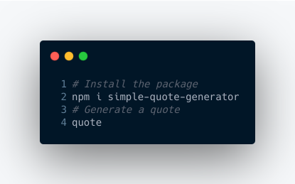

# Simple Quote Generator

`simple-quote-generator` is a CLI tool that generates a random quote everytime the use executes a command

### Installation

- Run `npm i -g simple-quote-generator`
- Execute `quote` command to get a new quote

> Node should be installed in your system

### Contributions

To install locally

- `git clone https://github.com/MuhammadWasif/simple-quote-generator.git`
- `cd simple-quote-generator`
- Run `npm install`
- Execute `node index.js`
